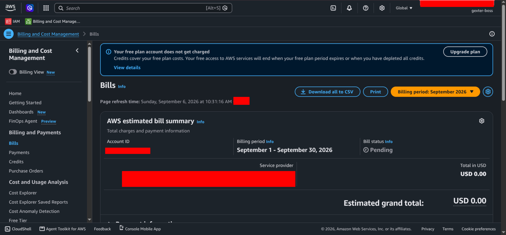
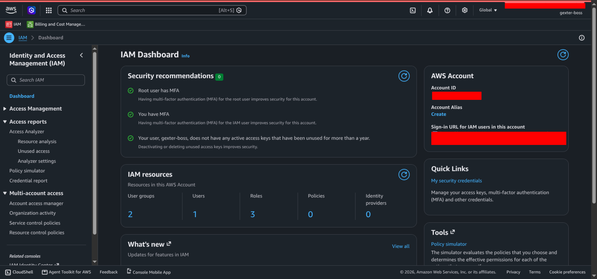
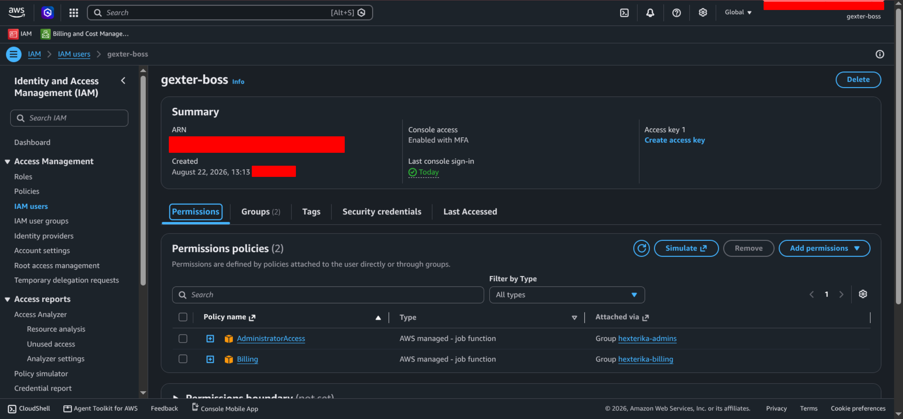
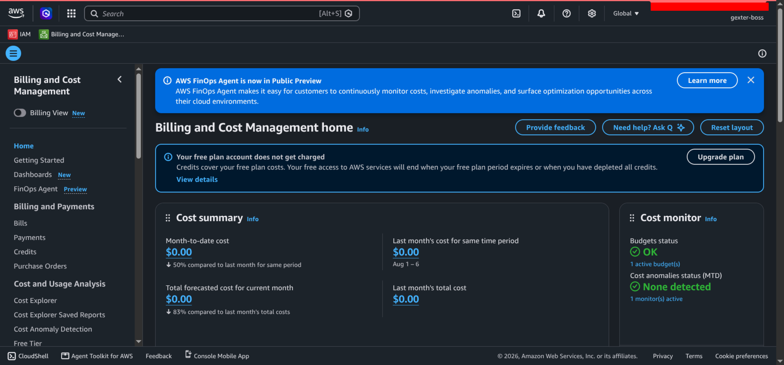
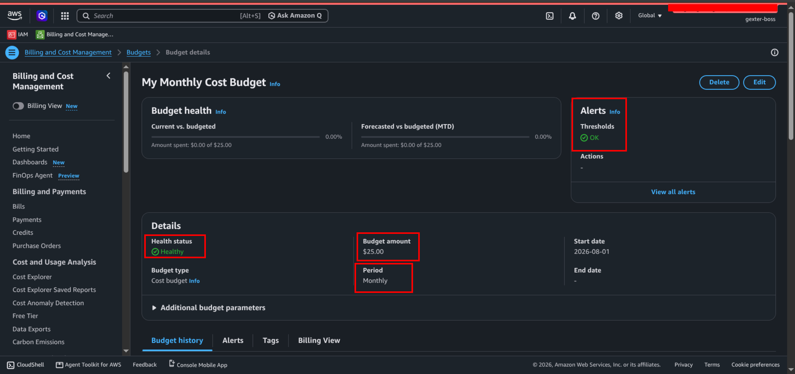
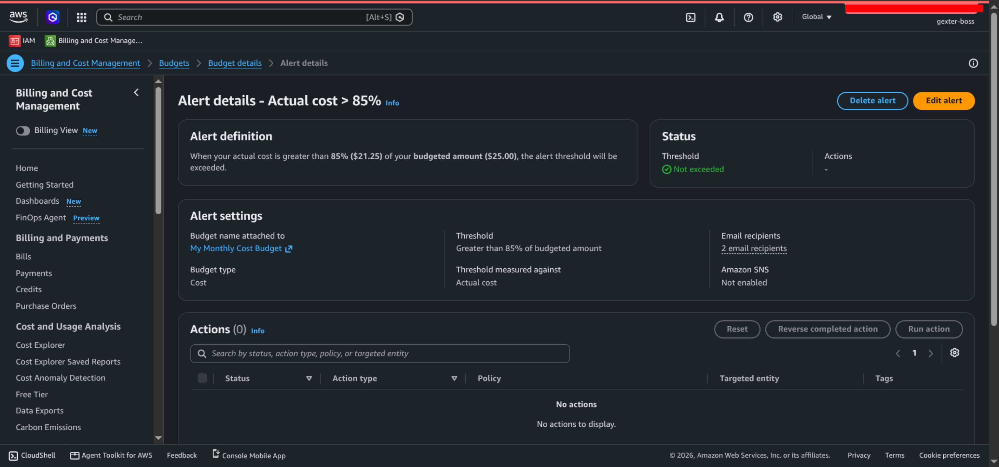
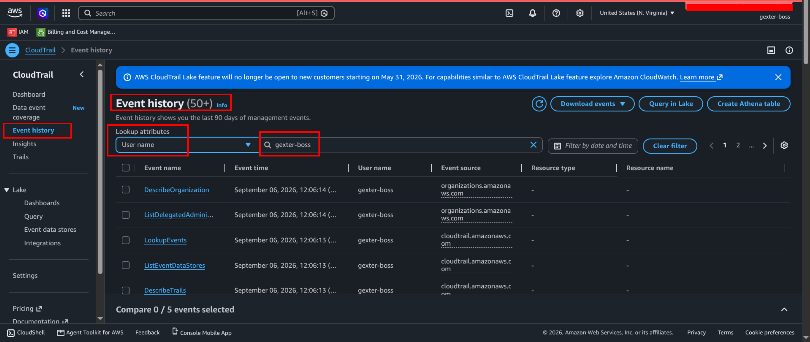

# Walkthrough 01 — Generic Account-Wide Management Setup

## Objective

* Create an administrative IAM user for normal AWS account management.
* Keep the AWS root user separate from routine administration.
* Establish permissions and controls that remain consistent across every lab.
* Prepare account-wide cost and security monitoring.

## Relationship to Other Walkthroughs

Walkthrough 00 covers initial account creation, root-user MFA, confirmation that the root user has no access keys, and selection of `us-east-1` for the billing alarm.

This walkthrough begins the ongoing account-wide configuration. It defines the administrator used to create and manage the individual lab environments.

Walkthroughs 02 and later define permissions specific to fictional organizations. Those permissions do not replace or restrict the account administrator.

## Administrative Identities

### AWS Root User

The root user remains the owner of the AWS account. It is not used for routine administration.

Root credentials are used only when AWS requires them or when an account-level setting cannot be changed by an IAM administrator.

For this walkthrough, the root user may be required to:

* Activate IAM user and role access to Billing and Cost Management.
* Maintain root credentials and MFA.
* Perform other root-only account recovery or ownership tasks when necessary.

### `gexter-boss`

`gexter-boss` is the primary AWS account administrator used across every lab in this repository.

It is responsible for:

* Creating and removing lab IAM users, groups, roles, and policies.
* Creating and managing AWS resources required by the labs.
* Managing account-wide security-monitoring settings.
* Managing billing and cost-monitoring settings.
* Verifying the configuration and permissions of lab identities.
* Cleaning up lab resources when they are no longer required.

`gexter-boss` is not an employee or operational user inside any fictional lab. Its administrative permissions are therefore excluded from the least-privilege tests performed on lab-specific users.

## IAM Group Structure

Permissions are assigned to `gexter-boss` through IAM user groups instead of being attached directly to the user.

| IAM group | Attached AWS-managed policy | Purpose |
| --- | --- | --- |
| `hexterika-admins` | `AdministratorAccess` | Provides the account administrator with permission to create and manage AWS identities, policies, services, and lab resources. |
| `hexterika-billing` | `Billing` | Explicitly assigns responsibility for billing, budgets, payment methods, and cost management. |

`gexter-boss` is currently the only member of both groups.

Although `AdministratorAccess` already provides broad AWS permissions, the separate billing group documents billing as an assigned administrative function and allows billing access to be delegated separately in the future.

## Authentication and Credentials

The current `gexter-boss` configuration uses:

* AWS Management Console access.
* Multi-factor authentication.
* Permissions inherited from IAM user groups.
* No programmatic access key unless one becomes necessary for later CLI work.

CLI and infrastructure-as-code access will be addressed separately when those methods are introduced. Long-term access keys should not be created merely to demonstrate that they exist.

## Account-Wide Responsibility Boundary

| Account-wide task | Responsible identity | Permission or control |
| --- | --- | --- |
| Protect root credentials | Root user | Root password, MFA, and account-recovery controls |
| Activate IAM access to Billing | Root user | Root-only account setting |
| Perform routine AWS administration | `gexter-boss` | Membership in `hexterika-admins` |
| Manage billing and cost controls | `gexter-boss` | Membership in `hexterika-billing` |
| Modify account-wide security monitoring | `gexter-boss` | Administrative access to the selected monitoring services |
| Create lab identities and resources | `gexter-boss` | `AdministratorAccess` |
| Use lab resources | Lab-specific identities | Permissions defined by each lab |

A task assigned here should not automatically be granted to an organization-specific IT group. For example, `hexterika-it` may maintain hospital technology, but account-wide billing, IAM administration, and security-monitoring configuration remain with `gexter-boss`.

## Current Configuration

The current account contains:

* One IAM user: `gexter-boss`.
* Two IAM user groups: `hexterika-admins` and `hexterika-billing`.
* `AdministratorAccess` attached to `hexterika-admins`.
* `Billing` attached to `hexterika-billing`.
* `gexter-boss` assigned to both groups.
* MFA enabled for both the root user and `gexter-boss`.
* No customer-managed IAM policies at this stage.

## Planned Account-Wide Controls

The following controls will be evaluated and configured before building the organization-specific labs:

* IAM access to Billing and Cost Management.
* Account-wide activity logging.
* Security findings and monitoring.
* Review of unused credentials and permissions.

The exact AWS services and settings will be selected during implementation. They are not treated as completed until they have been configured and verified in the AWS account.

---

## Account-Wide Verification

The following tests verify the minimum account-wide configuration required before beginning the organization-specific labs. Advanced security-monitoring controls may be added later.

### Test 1 — Billing Access

AdministratorAccess does not by itself allow an IAM user to open the Billing and Cost Management pages. IAM access to billing is a separate account-level setting that only the root user can activate. This test confirms that the setting was activated and that billing administration can be carried out by gexter-boss rather than by signing in as root.

**Test:** Sign in as `gexter-boss` and open the Billing and Cost Management Bills page.

**Expected result:** The Bills page opens without an access-denied error.

**Result:** Passed. `gexter-boss` can view the account’s billing information.

### Test 2 — Administrative Authentication and Credentials

Permissions are attached to groups rather than directly to the user so that access is defined by administrative function and can be granted to an additional person without rebuilding it. This test also records the current access model: `gexter-boss` uses console sign-in with MFA and holds no access key, because no task so far has required programmatic access. Programmatic credentials will be created when CLI or infrastructure-as-code work begins, and the method will be selected at that point rather than provisioned in advance.

**Test:** Verify the IAM groups, MFA device, and access-key status of `gexter-boss`.

**Expected result:**

* `gexter-boss` belongs to `hexterika-admins` and `hexterika-billing`.
* MFA is enabled on console sign-in.
* No access key is present, matching the console-only access in use at this stage.

**Result:** Passed. `gexter-boss` signs in to the console with MFA and receives all permissions through the two designated IAM groups. No access key is present, which matches the access model recorded above.

### Test 3 — Cost Monitoring

A budget and Cost Anomaly Detection cover different failure modes. The budget alerts when spend crosses a threshold that was set manually, so it depends on the threshold being correct. Cost Anomaly Detection compares spend against the account's established pattern and reports deviation from it, which surfaces unexpected usage — such as resources launched in an unused region — before a monthly threshold would be reached.

**Test:** Verify that an AWS Budget, email notifications, and Cost Anomaly Detection are configured.

**Expected result:**

* A monthly cost budget is active.
* The budget has defined alert thresholds.
* At least one alert has an email recipient.
* A Cost Anomaly Detection monitor is active.
* The budget and anomaly monitor report a healthy status.

**Result:** Passed. A monthly cost budget of $25 is active and healthy. It includes actual and forecasted cost thresholds, with two email recipients configured for the 85% actual-cost alert. Cost Anomaly Detection also has one active monitor, with no anomalies detected at the time of verification.

### Test 4 — Account Activity History

CloudTrail Event history is enabled by default on every AWS account and retains 90 days of management events at no additional cost. It is checked here to confirm the account has a usable activity record for troubleshooting and investigation, and that administrative actions are attributed to a named IAM user rather than the root user. It records management events only; data-level events such as individual S3 object access are outside its scope.

**Test:** Open AWS CloudTrail Event history and filter the recorded management events by the username `gexter-boss`.

**Expected result:** CloudTrail Event history displays recent account-management activity attributed to `gexter-boss`.

**Result:** Passed. CloudTrail displayed more than 50 management events associated with `gexter-boss` within its 90-day Event history.

### Verification Summary

| Test                                          | Status |
| --------------------------------------------- | ------ |
| Billing access                                | Passed |
| Administrative authentication and credentials | Passed |
| Cost monitoring and notifications             | Passed |
| CloudTrail Event history                      | Passed |

---

## Sources

AWS recommends reserving the root user for tasks that specifically require root credentials. Activating IAM access to the Billing and Cost Management console is one such root-user task.

* [AWS account root user](https://docs.aws.amazon.com/IAM/latest/UserGuide/id_root-user.html)
* [Setting up IAM access to Billing](https://docs.aws.amazon.com/IAM/latest/UserGuide/getting-started-account-iam.html)
